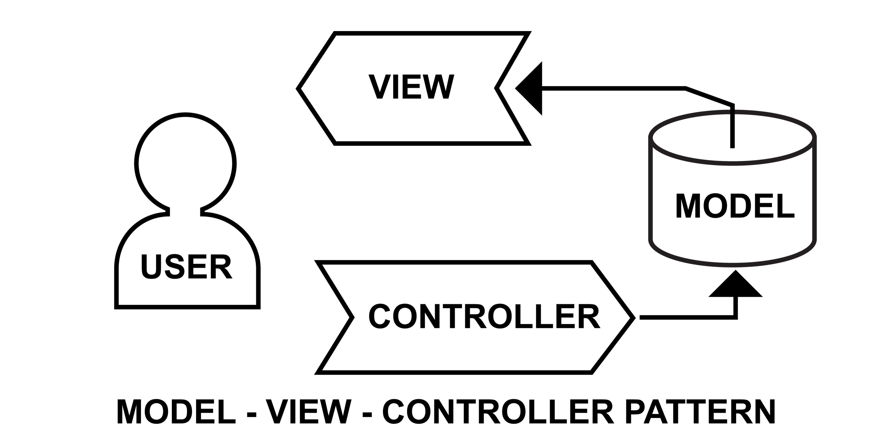

# SistemaEstudiantes
🎓 Sistema de Gestión de Estudiantes
Un sistema de escritorio robusto diseñado para la administración eficiente de registros académicos. Permite realizar operaciones CRUD (Crear, Leer, Actualizar y Eliminar) sobre una base de datos de estudiantes a través de una interfaz gráfica intuitiva.
---

🚀 Características Principales
Gestión Completa de Estudiantes: Registro de nombres, apellidos, teléfonos y correos electrónicos.

Arquitectura MVC: Separación clara de responsabilidades entre la lógica de negocio, los datos y la visualización.

Persistencia de Datos: Conexión estable a base de datos MySQL.
---

🏗️ Arquitectura del Proyecto
El proyecto sigue el patrón de diseño Modelo-Vista-Controlador, lo que facilita su mantenimiento y escalabilidad:

---

🛠️ Requisitos del Sistema
Antes de ejecutar el proyecto, asegúrate de tener instalado:
Java JDK 17 o superior.
MySQL Server.
Driver JDBC de MySQL (incluido en las dependencias).
Un IDE de tu preferencia (IntelliJ IDEA, NetBeans, Eclipse).

---

⚙️ Configuración e Instalación
Clonar el repositorio:

git clone https://github.com/Isabela-CA/SistemaEstudiantes.git

Configurar la Base de Datos:
Crea una base de datos llamada estudiantes_db (o el nombre especificado en tu clase Conexion).
Ejecuta el script SQL

Ajustar credenciales:
Navega a src/main/resources/application.properties , actualiza tu usuario y contraseña de MySQL.

---

👨‍💻 Autora
Isabela Carrillo Azain